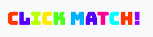

<a href="https://rexayo.github.io/click-match/"></a>

##### Click logo above to view live project

<h2 align="center"></h2>

Click Match! is a memory game based on colour recogniton and perception. The human eye has the capacity to recognise a broad range of colours,but subtle differences in how we perceive the colours aren't often highlighted. This aims to make the exercise of colour recognition both fun and engaging.

We see colours all the time but rarely pay attention differences in the hues, saturation and brightness. It is my hope that in playing this game we grow to observe colours more acutely and consequently the world at large.

## User Experience (UX)

- ### User Stories

  - #### First Time Visitor Goals

    a. As a First Time Visitor, I want to easily understand the main purpose of the site and learn more about the game.  
    b. As a First Time Visitor, I want to be able to easily navigate throughout the site to find content.

    c. As a First Time Visitor, I want to easily find details about the rules of the game.

    d. As a First Time Visitor, I want to be able to measure my progress as I play the game.

    e. As a First Time Visitor, I want to be able to adjust the background colour around the colour grid, if my eyes are more sensitive to light.

  - #### Returning Visitor Goals

    a. As a Returning Visitor, I want to be able to easily continue the game, whilst keeping track of how well I have done in previous attempts.  
     b. As a Returning Visitor, I want to find the best way to get in contact with the organisation with any questions I may have.

  - #### Frequent User Goals

    a. As a Frequent User, I want to sign up to be made aware of new levels as and when they are added.

* ### Design

  - #### Colour Scheme

    - The colour scheme across the website is a combination of tints of greys and black. As the main focus is colour recognition I chose to keep everything other element except the logo muted to reduce distractions. I chose a randomisation of colours on the logo on each page load to highlight the fact that the colours of the grid are shuffled everytime.

    <!-- <h2></h2> -->

  - #### Typography
    - The Google fonts Bungee and IBM Plex Mono are the two fonts used across the website with Cursive and Monospace as the alternative fonts respectively, for cases when the default options aren't loaded onto the website correctly.
      Both fonts are very legible and contrast nicely together. With Bungee serving as the primary font giving the website are playful across all major sections and IBM Plex Mono as the body text used to create contrast to very bold look of Bungee.

- ### Wireframes

  Initial Wireframes developed at the start of the project are <a href="assets/images/RexAbba-AbbaMilestoneProjectWireframe.pdf" download>here.</a>.

## Features

This section contains all the features of the website.

### Game Play Section

This is the main section of the game play and is built using a responsive grid of a 120 div elememts, these divs are progressively divided to create Levels 1 to 4, containing 4, 8, 16 and 32 colour grids respectively. The gameplay is activated in the following sequence.

- On page load, the user is presented with level 1 which contains 4 boxes all coloured grey.
- A "hint" text above the boxes let's the user know to click on the game-pad icon below the boxes.
- Upon click the boxes momentarily reveal the colours below them. The duration of how long the colours are displayed increases as the game progresses to more difficult levels.
- Next, the hint suggests to the click on the boxes with a goal to reveal the colour pairs in sequence.
- A collection of game statistics help to inform the user of how many times they have clicked, the number of clicks left and scores.

### Navigation bar

This section provides information on difficulty selections. An indication of what level the game is currently on and a toggle to switch the colour grid talked about above between light and drk mode.

### How to Play

This how-to section contains a breakdown of the rules of the game and an explanation of all the statistics that help the user progress through the levels and measures how much they have achieved in the process.

### Sign Up form and Email Contact Icon

This beta version of the game currently has only four levels. The sign up form here serves to help the users sign up for updates to the game as more features/levels added.
There's also a email message theat enables users directly contact the games developer, by launching an email application and prefilling the contact email address.

### Features Left to Implement

- Implement audio responses to clicks and gameplay.
- Improve animation across gameplay with nuanced motion when pairs are matched and when a wrong box is clicked. Using a flip animation to reveal the boxes and also have the background ripple in response to the last box clicked.
- Add more levels with introduction of shapes into the recognition role. This will enable more flexibilty in creating variation between levels.

## Technologies Used

### Languages Used

- HTML5
- CSS3
- jQuery and Javascript
- Hover.css
- EmailJS
- Hero Patterns

### Frameworks, Libraries & Programs Used

- [Bootstrap](https://getbootstrap.com/)

  - The games uses Bootstrap's library to aid responsiveness across various screen sizes and devices. The Colour grid is built entirely with bootstrap with column classes that enables dynamic adjustment regardless of screen size.

- [JQuery](https://jquery.com) and Javascript

  - Bootstrap includes jQuery, which is used in both the navbar responsiveness and dropdown menu.
  - jQuery and Javascript are used to populate the coloured grids across all the levels and also drive the automation of level changes.
  - The light and dark mode toggle use both jQuery and Javascript.
  - The game-pad icon's functionality uses both jQuery and Javascript to drive the assigning of colours to the coloured grids.

- [Google Fonts](https://fonts.google.com/)

  - Google fonts were used to import the "Bungee" and the "IBM Plex Mono" font into the style.css file which are across the project.

- [Font Awesome](https://fontawesome.com/)

  - Font Awesome was used for the light and dark mode togge, the game-pad icon and email icon in the footer, these help to improve User Experience and User Interface design.

- [Git](https://git-scm.com/)

  - Git was used for version control by utilizing the Gitpod terminal to commit to Git and Push to GitHub.

- [GitHub](https://github.com/)

  - GitHub is used to store the projects code after being pushed from Git.

- [Balsamiq](https://balsamiq.com/)

  - Balsamiq was used to create the wireframes during the design process.

- [EmailJS](https://www.emailjs.com/)

  - EmailJS was used to get information from the signup form as users choose to signup for updates.

- [Hero Patterns](www.heropatterns.com)

  - A background-image css styling was used from hero patterns to give a subtle texture to background of the website.

- [Hover.css](https://ianlunn.github.io/Hover/)
  - Hover.css was used for the looping bob animation on the game-pad icon.

## Testing

The W3C Markup Validator and W3C CSS Validator Services were used to validate the index.html page to ensure there were no syntax errors in the project. No errors were found during the validation process, but a few warnings were flagged relating to certain sections not having header tags. These were intentional choices and they don't affect the functionality of the website.

- [W3C Markup Validator](https://validator.w3.org/#validate_by_input)
- [W3C CSS Validator](https://jigsaw.w3.org/css-validator/#validate_by_input)

  <a href="assets/images/Validator Results.zip" download>Download results here</a>

### Testing User Stories from User Experience (UX) Section

- #### First Time Visitor Goals

  1. As a First Time Visitor, I want to easily understand the main purpose of the site and learn more about the game.

     - Upon entering the site, users are automatically greeted with a clean and easily readable navigation bar with name of the game.
     - The game has a one-page layout which enables all the information the user needs to be in one place at a glance.

  2. As a First Time Visitor, I want to be able to easily navigate throughout the site to find content.

     - The site has been designed to be minimal with little distraction to its main focus which the colour grid. As a user enters the site they are no preambles or unnecessary steps before game play begins.

  3. As a First Time Visitor, I want to easily find details about the rules of the game. 

     - The how to play section is right below the colour grid with a detailed explanation of how the game works. 

   4. As a First Time Visitor, I want to be able to measure my progress as I play the game.

        - Below the how-to-play rules is a breakdown of all the game statistics and how they are calculated.
    
    5. As a First Time Visitor, I want to be able to adjust the background colour around the colour grid, if my eyes are more sensitive to light.

        - There is light and dark toggle on the naviagtion bar that helps the user switch tne colour grid's background to a dark colout for better contrast with the colours.

- #### Returning Visitor Goals

  1. As a Returning Visitor, I want to be able to easily continue the game, whilst keeping track of how well I have done in previous attempts.  

     - The navigation bar has a dropdown menu with all the available difficulty levels. So user can play whatever level where previously stuck. Alternatively by default the game expects users to start from level 1 and work their way up in order rack up more points and accumulate more usable clicks for the more difficult levels.

  2. As a Returning Visitor, I want to find the best way to get in contact with the organisation with any questions I may have.

     1. On the footer there is a mail icon with a message beside it, letting the user know to send am email when a problem is encoutered or for general inquires, that enquires. This email button on the footer is set up to automatically open up user's email app and autofill the website's email address in the "To" section.

* #### Frequent User Goals

  1. As a Frequent User, I want to sign up to be made aware of new levels as and when they are added.

     - There are forms both at the footer of the page and also at the end of leve 4, thst help the user send a contact email address to receive alerts on addition of new levels and general gameplay additions.

 

### Further Testing

- The Website was tested on Google Chrome, Internet Explorer, Microsoft Edge and Safari browsers.
- The website was viewed on a variety of devices such as Desktop, Laptop, Samsung Galaxy Note 10, Samsung S9 & iPhone8 and iphone 12.
- A large amount of testing was done to ensure that all pages were linking correctly.
- Friends and family members were asked to review the site and documentation to point out any bugs and/or user experience issues.
- Additional automated testing was done using [Browser Stack](https://live.browserstack.com/)

## Deployment

### GitHub Pages

The project was deployed to GitHub Pages using the following steps...

1. Log in to GitHub and locate the [GitHub Repository](https://github.com/Rexayo/click-match)
2. At the top of the Repository (not top of page), locate the "Settings" Button on the menu.
3. Scroll down the Settings page until you locate the "GitHub Pages" Section.
4. Under "Source", click the dropdown called "None" and select "Master Branch".
5. The page will automatically refresh.
6. Scroll back down through the page to locate the now published site [link](https://rexayo.github.io/click-match/) in the "GitHub Pages" section.

### Making a Local Clone

1. Log in to GitHub and locate the [GitHub Repository](https://github.com/Rexayo/click-match)
2. Under the repository name, click "Clone or download".
3. To clone the repository using HTTPS, under "Clone with HTTPS", copy the link.
4. Open Git Bash
5. Change the current working directory to the location where you want the cloned directory to be made.
6. Type `git clone`, and then paste the URL you copied in Step 3.

```
$ git clone https://github.com/Rexayo/click-match
```

7. Press Enter. Your local clone will be created.

```
$ git clone https://github.com/Rexayo/click-match.git
Cloning into 'everyday-why'...
remote: Enumerating objects: 140, done.
remote: Counting objects: 100% (140/140), done.
remote: Compressing objects: 100% (83/83), done.
Receiving objects:  90% remote: Total 329 (delta 73), reused 109 (delta 44), pack-reused 189
Receiving objects: 100% (329/329), 82.67 MiB | 6.53 MiB/s, done.
Resolving deltas: 100% (153/153), done.
```

Click [Here](https://help.github.com/en/github/creating-cloning-and-archiving-repositories/cloning-a-repository#cloning-a-repository-to-github-desktop) to retrieve pictures for some of the buttons and more detailed explanations of the above process.

## Credits

### Code

- [Bootstrap](https://getbootstrap.com/docs/3.3/getting-started/): Bootstrap Library was used throughout the project mainly to make the website responsive using the Bootstrap Grid System.

- [HTML & CSS](https://www.w3schools.com/): I researched a lot of code support from W3 Schools. Additional research on CSS was done on [CSS Tricks](https://css-tricks.com/). Animation on game icon was done with [Hover.css](https://ianlunn.github.io/Hover/). Lastly background-image pattern wsa done with [Hero patterns](www.heropatterns.com).


- Code Pen - [Random number generator function](https://codepen.io/meowwwls/pen/jbEJRp), 
- Stack Overflow 
    - [Fisher Yates Shuffle used to shuffle Arrays for colour selection](https://stackoverflow.com/questions/2450954/)
  - [Random colour on each letter of the logo](https://stackoverflow.com/questions/20228961/how-to-make-each-letter-in-text-a-different-random-color-in-javascript)
- Github - [Generating random HSL colours](https://mika-s.github.io/javascript/colors/hsl/2017/12/05/generating-random-colors-in-javascript.html)

## Credits

### Acknowledgements

- I received inspiration for this project from a colour recognition game on iOS called [Specimen](https://apps.apple.com/us/app/specimen-a-game-about-color/id999930535) created by Pep Rally. Also the idea of clicking the boxes to reveal what's behind them comes from traditional card games that rely on flipping cards to reveal what's underneath.
